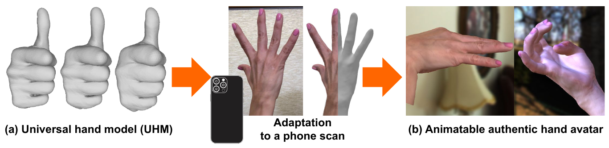
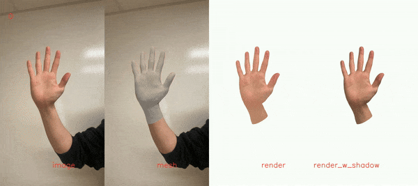
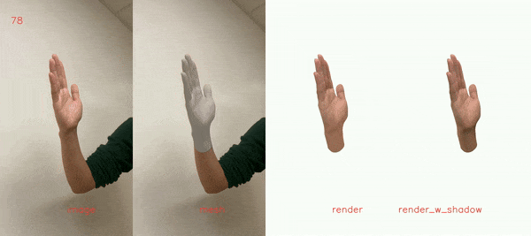
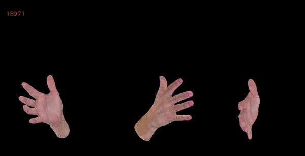
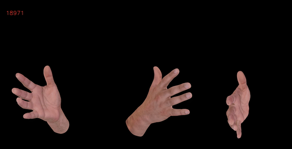
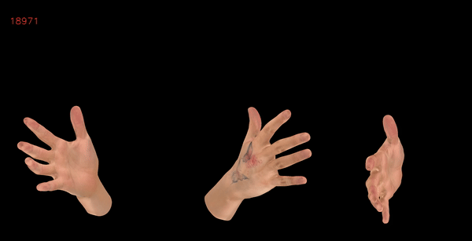
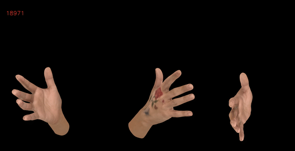

# Authentic Hand Avatar from a Phone Scan via Universal Hand Model

## Introduction

This folder is for creating authentic hand avatars from a short phone scan and playing with the avatars. To this end, we utilize our pre-trained UHM.

<p align="middle">

</p>

## Directory

### Root

`${ROOT}` is described as below.
```
${ROOT}
|-- data
|-- main
|-- output
|-- tool
|-- common
|   |-- utils
|   |   |-- UHM
|   |   |   |-- template.obj
|   |   |   |-- template.pkl
|   |   |   |-- ckpt.pth
|   |   |   |-- uhm.py
|   |   |-- human_model_files
|   |   |   |-- mano
|   |   |   |   |-- MANO_RIGHT.pkl
```
* `data` contains data loading codes and soft links to the original data directories.
* `main` contains high-level codes for training or testing the network.
* `output` contains log, trained models, visualized outputs, and test result.
* `tool` contains pre-processing code.
* `common` contains kernel code. Download `UHM` from [here](https://github.com/facebookresearch/UHM/tree/main/UHM). Download `MANO_RIGHT.pkl` from [here](https://mano.is.tue.mpg.de/).

### Data (Public datasets)
You need to follow directory structure of the `data` as below.
```
${ROOT}
|-- data
|   |-- Ours
|   |   |-- data
|   |   |   |-- AXE977
|   |   |   |-- QVC422
|   |   |   |-- QZX685
|   |   |   |-- XKT970
|   |-- HARP
|   |   |-- data
|   |   |   |-- subject_1
```
* `Ours` dataset has our new phone scans from four different subjects. This will be available from [here](https://codec-avatars.github.io/cvpr24/) soon.
* `HARP` dataset can be downloaded from [here](https://github.com/korrawe/harp#preprocessed-sequence). Download 2D keypoints of Mediapipe from [here](https://1drv.ms/f/s!All7gdNh7XE5lWv_bv6pXD3adDz7?e=wll259). Unzip it and place `keypoints_from_mediapipe` folder at `subject_1/1/keypoints_from_mediapipe`, for example.

### Data (Your own phone scans)

You need to follow directory structure of the `data` as below.
```
${ROOT}
|-- data
|   |-- Custom
|   |   |-- data
|   |   |   |-- $SUBJECT_NAME
|   |   |   |   |-- frame_list_train.txt
|   |   |   |   |-- frame_list_test.txt
|   |   |   |   |-- $SEQ_IDX_1
|   |   |   |   |   |-- frames
|   |   |   |   |   |-- masks
|   |   |   |   |   |-- keypoints
|   |   |   |   |   |-- mano_params
|   |   |   |   |   |-- depthmaps
|   |   |   |   |   |-- cam_param.json
|   |   |   |   |-- $SEQ_IDX_2
|   |   |   |   |-- $SEQ_IDX_3
|   |   |   |   |-- ...
|   |   |   |-- ...
```
* You can use your own phone scans, which consist of short (usually under 15 seconds) phone scans with simple hand poses.
* Example data made with HARP dataset is available in [here](https://drive.google.com/file/d/1ec_l8hpbNrjEL6RBXn5n6QBhI74mFRli/view?usp=sharing).
* `$SUBJECT_NAME` folder contains data from a single subject.
* `frame_list_train.txt` and `frame_list_test.txt` contain sequence and frame indices for the training and testing, respectively.
* Each of `$SEQ_IDX_1`, `$SEQ_IDX_2`, `$SEQ_IDX_3`, ... folder contains data from a single video. By preparing multiple `$SEQ_IDX` folders, you can use multiple videos for the training and testing.
* `masks`: Download code and resnet50 checkpoint of [RVM](https://github.com/PeterL1n/RobustVideoMatting). Copy `rvm_resnet50.pth` of RVM and `tool/run_rvm.py` to the downloaded folder and run `python run_rvm.py --root_path $ROOT/data/Custom/data/$SUBJECT_NAME`.
* `keypoints`: Run `pip install mediapipe` and go to `tool` folder. Run `python run_mediapipe.py --root_path $ROOT/data/Custom/data/$SUBJECT_NAME`.
* `mano_params`: Download code and checkpoint of [InterWild](https://github.com/facebookresearch/InterWild). Copy `snapshot_6.pth` of InterWild and `tool/run_interwild.py` to the `demo` folder of InterWild and run `python run_interwild.py --root_path $ROOT/data/Custom/data/$SUBJECT_NAME`.
* `depthmaps`: `$FRAME_IDX.pkl`, which contains numpy array of depthmap with (height, width) shape in meter unit. The hieght and width of the depthmaps can be different from those of RGB images in `frames` folder as we resize it to the size of the RGB images in [here](https://github.com/facebookresearch/UHM/blob/406688247aa0a7422258ec3384912fb8483d3dc3/Avatar/data/Custom/Custom.py#L159). Depth values equal to or smaller than zero will be treated as invalid ones and be ignored.
* `cam_param.json`: A dict of {'focal': [focal_x, focal_y], 'princpt': [princpt_x, princpt_y]}. This is an intrinsic parameter of the RGB camera.
* `depthmaps` and `cam_param.json` are optional. If they are not available, follow above directory structure without them. The code will automatically ignore them if they are not available.


## Training and testing with a short phone scan

<p align="middle">


</p>
<p align="middle">


</p>

High-resolution videos are available in [[1]](https://drive.google.com/file/d/1yJLY7yXRQKhVmJx-3rcg0xbgfwdY7Pvu/view?usp=sharing) [[2]](https://drive.google.com/file/d/1BgqFTHCttzjfmNo2bMzhjxqG2CHKrBZr/view?usp=sharing) [[3]](https://drive.google.com/file/d/1_rs5MyXdvkM0CrOfqEXQ-u-oKRb-XdIs/view?usp=sharing) [[4]](https://drive.google.com/file/d/1Pi0da6ioTtiiv0CSLZRfa4OF5kdv144X/view?usp=sharing)


* Set `dataset` in `main/config.py`.
* Set `subject_id_list` of `main/run.py`.
* Run `python run.py`.
* It will create a hand avatar for each ((`$SUBJECT_ID` in `subject_id_list`), (`dataset` in `main/config.py`)) pair.
* After the training, for the evaluation purpose, the PoseNet and ShadowNet are fine-tuned on the test set (check [here](https://github.com/facebookresearch/UHM/blob/cd732a79f1b20e28a394a1d20aa392a150256fb8/Avatar/main/model.py#L35)) following previous works (e.g., HARP) like [this](https://github.com/korrawe/harp/blob/ea9d46505aa6d0b4a30066f55ddbe2c61e7e23b0/optimize_sequence.py#L263) and [this](https://github.com/korrawe/harp/blob/ea9d46505aa6d0b4a30066f55ddbe2c61e7e23b0/optimize_sequence.py#L307).
* For `HARP` dataset, we use ['1', '2', '3', '4', '5'] for the training and ['6', '7', '8', '9'] for the testing (hard-coded in [here](https://github.com/facebookresearch/UHM/blob/cd732a79f1b20e28a394a1d20aa392a150256fb8/Avatar/data/HARP/HARP.py#L43)) following [this](https://github.com/korrawe/harp/blob/ea9d46505aa6d0b4a30066f55ddbe2c61e7e23b0/utils/data_util.py#L76).
* For `Ours` dataset, we support 3D evaluation by running `python eval_3d.py --subject_id $SUBJECT_ID`.
* Checkpoints are saved to `output/model_dump/$SUBJECT_ID`.
* Dumped results are saved to `output/result/$SUBJECT_ID`.
* Evaluation results are saved to `main/eval_results/$SUBJECT_ID.json`.
* 3D evaluation results are saved to `main/eval_results_3d/$SUBJECT_ID/.`.


## Driving with new poses

<p align="middle">


</p>
<p align="middle">


</p>

* Download poses from [here](https://drive.google.com/file/d/1KE0l43fCmkBOkDibOss152ZwqBiX8ZsG/view?usp=sharing) and unzip it at `main/driving_poses` folder.
* Run `python drive.py --subject_id $SUBJECT_ID`.
* The driven avatar is rendered to three viewpoints and saved to `main/drive_results/$SUBJECT_ID.mp4`. For the rendering, we only use albedo without shadow as our ShadowNet is trained only on small amount of viewpoints and poses.


## Pre-trained avatars

* There are two checkpoints for each avatar. First one is trained on the training set without fine-tuning PoseNet and ShadowNet on the test set. Second one is obtained by fine-tuning PoseNet and ShadowNet of the first checkpoint on the test set. The second one is used for the evaluation as described in . Let us denote the first and second one by `Before FT` and `After FT`, respectively.
* `AXE977` subject of `Ours` dataset: [[Before FT]](https://drive.google.com/drive/folders/1-CeC9ZnSyKy_WeVuv9S4YbvWrjq9lgKk?usp=sharing) [[After FT]](https://drive.google.com/drive/folders/13SJlzWMurWegZwa_miBbi7o4rV0nNj5L?usp=sharing)
* `QVC422` subject of `Ours` dataset: [[Before FT]](https://drive.google.com/drive/folders/1rcZLYITVHHhvyopMHuMmFlcp66P-GC_I?usp=sharing) [[After FT]](https://drive.google.com/drive/folders/1Qhzb2HkjumeygMrqIBnm9w-oZ6gj9f-A?usp=sharing)
* `QZX685` subject of `Ours` dataset: [[Before FT]](https://drive.google.com/drive/folders/1wykIEIGq7mPcRns1mK6qKjakd3VN86P4?usp=sharing) [[After FT]](https://drive.google.com/drive/folders/1sZYobWBi9Y-Xd5gOCiskH10FTRr6OCjR?usp=sharing)
* `XKT970` subject of `Ours` dataset: [[Before FT]](https://drive.google.com/drive/folders/1QZjM40BFpfSr33xOjiN4wxplXmd3IyOv?usp=sharing) [[After FT]](https://drive.google.com/drive/folders/1yNpbBH47eUL1exkFBytNUmnS_VJylWLh?usp=sharing)
* `subject_1` subject of `HARP` dataset: [[Before FT]](https://drive.google.com/drive/folders/1iDSC5vagJRVC2p1NXDNSmCkUpADWmGE5?usp=sharing) [[After FT]](https://drive.google.com/drive/folders/1GcaTVYxjysRSYiiaE3_ul0p94ipazwj6?usp=sharing)
