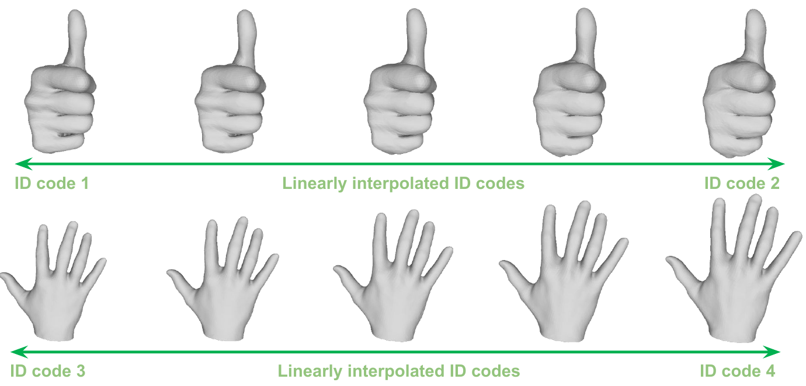
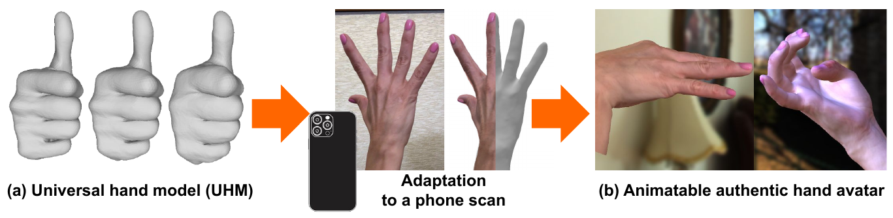

# Authentic Hand Avatar from a Phone Scan via Universal Hand Model

## Introduction
This repo is official PyTorch implementation of [**Authentic Hand Avatar from a Phone Scan via Universal Hand Model (CVPR 2024)**](https://arxiv.org/abs/2405.07933).
* Our Universal Hand Model (UHM) is a high-fidelity 3D hand model that can universally represent 3D hand surface of any identities. It takes 3D pose and ID latent code and outputs 3D hand surface with 3D hand keypoints. 
* Using it, we create authentic hand avatars from a short (around 15 seconds) phone scans, animatable with novel poses.

## UHM

<p align="middle">

</p>

If you're interested in playing with UHM, check [here](https://github.com/facebookresearch/UHM/tree/main/UHM).

## Authentic hand avatar

<p align="middle">

</p>

If you're interested in creating authentic hand avatars from a short phone scan using our UHM, check [here](https://github.com/facebookresearch/UHM/tree/main/Avatar).

## Reference  
```  
@InProceedings{Moon_2024_CVPR_UHM,  
author = {Moon, Gyeongsik and Xu, Weipeng and Joshi, Rohan and Wu, Chenglei and Shiratori, Takaaki},  
title = {Authentic Hand Avatar from a Phone Scan via Universal Hand Model},  
booktitle = {Computer Vision and Pattern Recognition (CVPR)},  
year = {2024}  
}  
```

## License
This repo is CC-BY-NC 4.0 licensed, as found in the LICENSE file.

[[Terms of Use](https://opensource.facebook.com/legal/terms)]
[[Privacy Policy](https://opensource.facebook.com/legal/privacy)]
