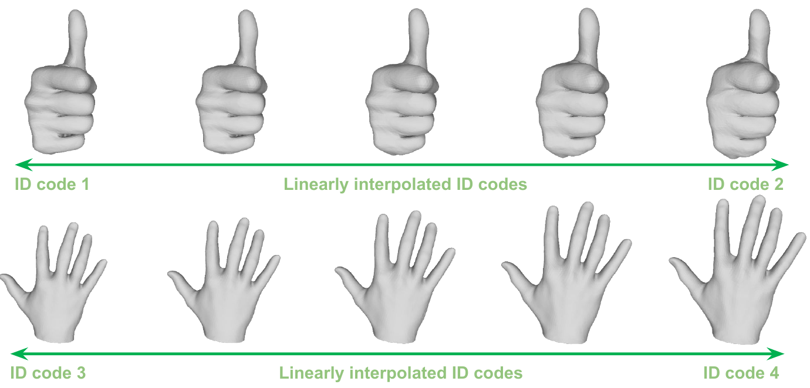
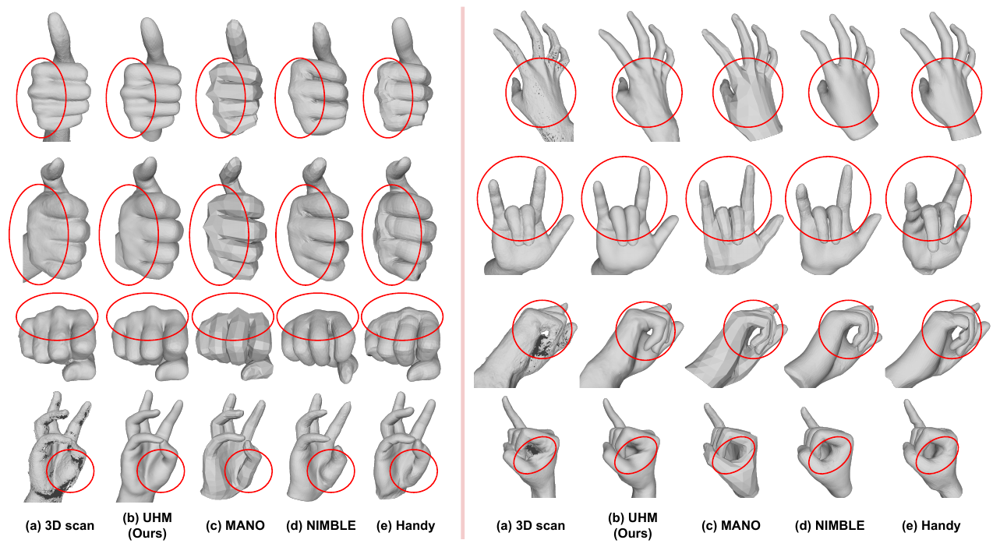
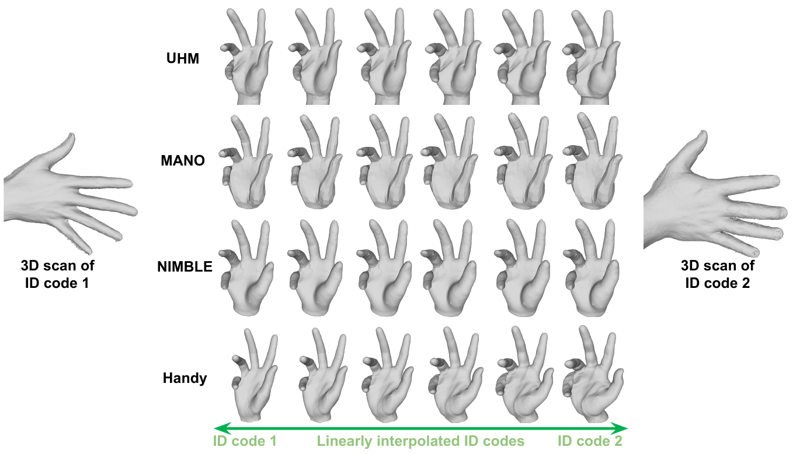

# Authentic Hand Avatar from a Phone Scan via Universal Hand Model

## Introduction
This folder is for playing with UHM. Our UHM is a high-fidelity 3D hand model that can universally represent 3D hand surface of any identities. It takes 3D pose and ID latent code and outputs 3D hand surface with 3D hand keypoints. 

<p align="middle">

</p>

## Directory
```
${ROOT}
|-- ckpt.pth
|-- template.obj
|-- template.pkl
|-- uhm.py
|-- demo
|   |-- demo.py
```
* `ckpt.pth` contains pre-trained weights of UHM. [[Download]](https://drive.google.com/file/d/1dFq5vPJWgonQjoXCel-z4Ipa9TDwy1eg/view?usp=sharing)
* `template.obj` contains xyz and UV vertex coordinates with the triangle face.
* `template.pkl` contains 3D poses of the `template.obj` and skinning weights for the LBS.
* `uhm.py` contains functions and class for the UHM with a wrapper.
* `demo/demo.py` contains a demo script to play with UHM.

## Demo
* Go to `demo` folder and run `python demo.py`.
* It will save `mesh.obj` and `mesh_from_code.obj`, which are from zero 3D hand pose and random latent pose code, respectively.
* For your own demo, feel free to edit `demo.py` as you want.

## Compare to existing 3D hand models

<p align="middle">

</p>
<p align="middle">

</p>